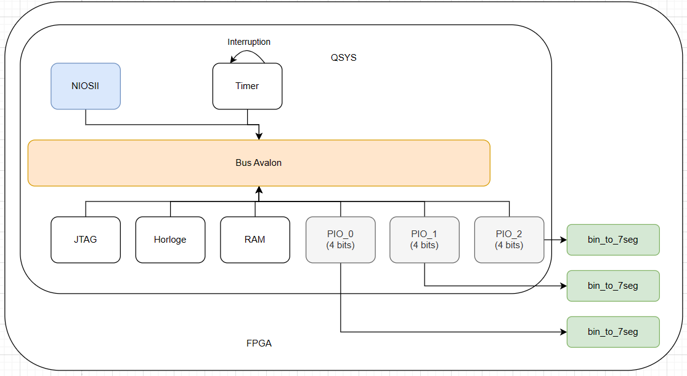
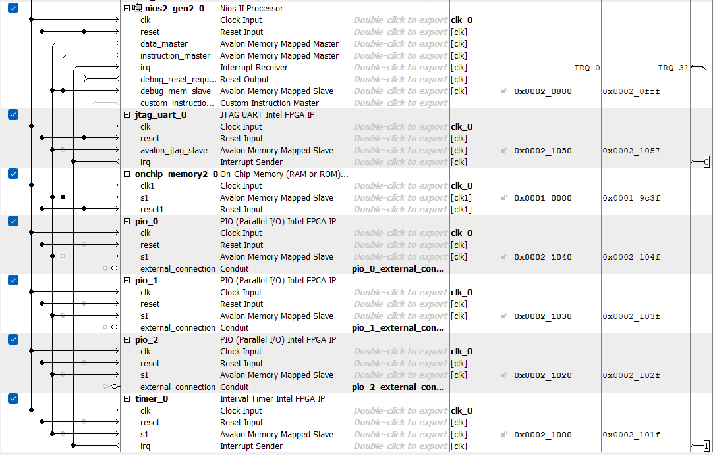

# Objectif
L'objectif du TP est de réaliser un compteur numérique et d'en afficher la valeur sur les digits de la DE10

# Intro
On veut pouvoir écrire un code source qui va générer un compteur incrémenté chaque seconde grâce à l'interruption générée par un timer.
Cette valeur va alors être envoyée à 3 décodeurs BCD qui vont convertir la valeur sur 4 bits en entrée pour allumer les digits correspondant au nombre reçu.

# Création d'une structure NIOSII standard et ajout d'un timer et 3 PIOs
## Schéma du système

## Platform designer

### Explication
- On ajoute une mémoire ***RAM*** et on lui alloue une taille de 40Ko pour nous laisser la liberté d'écrire le script en c.
- On ajoute un ***PIO_0*** qu'on va associer au premier décodeur VHDL
- On ajoute un ***PIO_1*** qu'on va associer au second décodeur VHDL
- On ajoute un ***PIO_2*** qu'on va associer au troisième décodeur VHDL
- On ajoute un ***Timer_0*** qui va générer une interruption toute les secondes

## Quartus
Le projet Quartus inclue le modèle QSYS décrit plus haut, un composant "bin_to_7seg" qui va être écrit en VHDL, et un "top" qui va assembler le QSYS et les 3 décodeurs pour pouvoir réaliser le système complet.

# Explication du code C
On a une routine d'interruption, et une fonction main().
- *irqhandler_timer* est la routine d'interruption appelée chaque seconde. Le compteur va donc être incrémenté de 1, et on va séparer le nombre de centaine, dizaine, et unité pour les envoyer à leur décodeur respectif.
- *main()* cette fonction principale enregistre l'interruption du timer et initialise le compteur à 0.

# Résultat
[Title](IMG_8029.MOV)

# Conclusion
Ce TP m'a permis de rentrer davantage dans le détail de la conception conjointe en liant du développement en c et du vhdl.
De plus, ayant fait plus de C que de VHDL auparavant, il est intéressant de s'y remettre pour développer ce système.